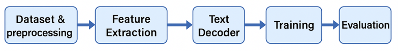
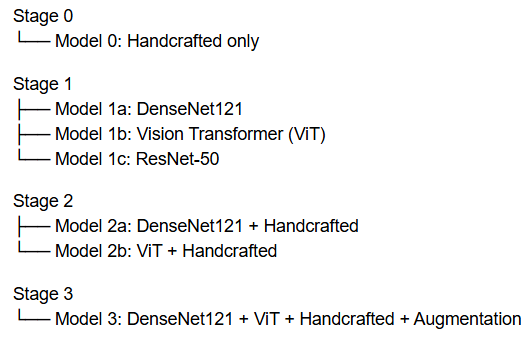

# Chest X-Ray Report Generation using Vision-Language Models

## Overview

Automatic radiology report generation is a challenging task that requires combining computer vision and natural language processing techniques. This project investigates multiple Vision-Language Model (VLM) architectures for generating clinically meaningful chest X-ray reports directly from medical images.

The work explores traditional handcrafted features, deep visual encoders, multimodal feature fusion, and parameter-efficient fine-tuning using LoRA. Multiple model configurations are implemented and compared to identify the most effective approach for automatic medical report generation.

---

## System Architecture



The proposed framework follows a multi-stage pipeline:

1. Dataset preprocessing and report cleaning.
2. Visual feature extraction from chest X-ray images.
3. Projection of image features into GPT-2 hidden space.
4. Report generation using GPT-2 with cross-attention.
5. Evaluation using BLEU, ROUGE-L, and BERTScore.

---

## Dataset

This project uses the Indiana University Open-I Chest X-ray dataset.

After preprocessing:

* 3,851 image-report pairs were obtained.
* Each sample contains:

  * Chest X-ray image
  * Corresponding radiology report

### Preprocessing Steps

* Missing value handling
* Report cleaning
* HTML and noise removal
* Text normalization
* Report reconstruction from:

  * Findings
  * Impression
  * Indication
* Duplicate removal
* Image-report matching using patient identifiers

---

## Model Variants



Several architectures were evaluated across multiple stages.

### Stage 0: Handcrafted Features Baseline

Traditional image descriptors were extracted and used as visual representations:

* Sobel Features
* Brightness Statistics
* GLCM Texture Features
* Local Binary Patterns (LBP)
* Histogram Statistics
* Canny Edge Features
* Laplacian Sharpness
* Brightness Range

These handcrafted representations were projected into GPT-2 for report generation.

---

### Stage 1: Deep Visual Encoders

#### DenseNet121 (CheXpert)

* Medical-domain pretrained model
* Extracts 1024-dimensional image representations
* Trained on chest X-ray data

#### Vision Transformer (ViT)

* ViT-Base-Patch16-224
* Self-attention based visual encoder
* Extracts 768-dimensional CLS embeddings

#### ResNet50

* ImageNet pretrained CNN
* Extracts 2048-dimensional image representations

---

### Stage 2: Hybrid Architectures

Two fusion approaches were investigated:

* DenseNet121 + Handcrafted Features
* ViT + Handcrafted Features

The objective was to determine whether handcrafted features can complement deep visual representations.

---

### Stage 3: Full Fusion Model

A multimodal fusion architecture combining:

* DenseNet121 Features
* Vision Transformer Features
* Handcrafted Features

into a single visual representation before report generation.

---

## GPT-2 Decoder

All visual features are projected into GPT-2 hidden space using a trainable projection layer.

GPT-2 acts as the language decoder and generates radiology reports using cross-attention between visual embeddings and textual tokens.

---

## Fine-Tuning Strategies

Three different training strategies were explored for the ViT + GPT-2 architecture.

### Full GPT-2 Fine-Tuning

* Frozen ViT encoder
* Fully trainable GPT-2 decoder

### LoRA Decoder Fine-Tuning

* Frozen ViT encoder
* LoRA applied only to GPT-2

### End-to-End LoRA

* LoRA applied to both ViT and GPT-2
* Joint optimization of visual and textual representations

---

## Technologies Used

* Python
* PyTorch
* Hugging Face Transformers
* GPT-2
* Vision Transformer (ViT)
* DenseNet121
* ResNet50
* LoRA (PEFT)
* NumPy
* Pandas
* Scikit-Learn

---

## Evaluation Metrics

Model performance was evaluated using:

* BLEU-1
* BLEU-2
* BLEU-3
* BLEU-4
* ROUGE-L
* BERTScore

The evaluation covers:

* Word-level similarity
* Phrase-level similarity
* Semantic similarity

---

## Experimental Results

| Model                     | BLEU-1     | ROUGE-L    | BERTScore  |
| ------------------------- | ---------- | ---------- | ---------- |
| Handcrafted + GPT-2       | 0.2939     | 0.2648     | 0.5594     |
| DenseNet121 + GPT-2       | 0.2611     | 0.2915     | 0.5856     |
| ViT + GPT-2               | 0.2960     | 0.2730     | 0.5682     |
| DenseNet121 + Handcrafted | 0.2937     | 0.2753     | 0.5717     |
| ViT + Handcrafted         | 0.2892     | 0.2761     | 0.5683     |
| Full Fusion               | 0.3007     | 0.2644     | 0.5560     |
| LoRA Decoder Only         | 0.3288     | 0.2839     | 0.5752     |
| LoRA End-to-End           | **0.3518** | **0.2937** | **0.6364** |

---

## Key Findings

* End-to-End LoRA achieved the best overall performance.
* DenseNet121 demonstrated strong semantic understanding of radiology reports.
* Handcrafted features improved DenseNet-based architectures.
* LoRA reduced training cost while improving report quality.
* BERTScore proved to be the most informative metric for medical report generation.
* Feature fusion improved robustness but did not always outperform the best transformer-based model.

---

## Repository Structure

```text
01_handcrafted_baseline.ipynb
02_densenet121_gpt2.ipynb
03_vit_gpt2.ipynb
04_densenet_handcrafted.ipynb
05_vit_handcrafted.ipynb
06_full_fusion.ipynb
07_vit_gpt2_lora.ipynb

architecture.png
model_variants.png
README.md
```

---

## Future Work

Potential future improvements include:

* Retrieval-Augmented Generation (RAG)
* Medical-specific language models
* Larger vision-language architectures
* Prompt tuning techniques
* Data augmentation for chest X-ray images
* Domain-specific report generation optimization

---

## Author

**Mariam Shehada**

M.Sc. Student in Artificial Intelligence

Areas of Interest:

* Natural Language Processing (NLP)
* Computer Vision
* Medical AI
* Arabic AI
